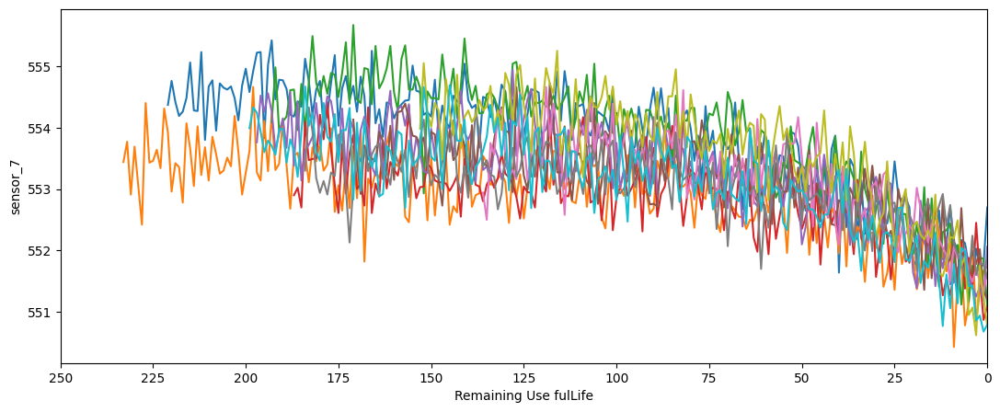

## NASA Turbofan Jet Engine (Predictive Maintenance)

### Data Preprocessing
To generate the Remaining Useful Life (RUL) for a training dataset based on time_cycles, need to reverse the time sequence and calculate the RUL for each unit by subtracting the current time_cycle from the maximum time_cycle observed for that unit.

Formula (RUL=Max Time Cycles for Unit−Current Time Cycle)

The maximum time_cycle for unit 1 is 5.

RUL calculation for each row:
- For time_cycle = 1, RUL = 5 − 1 = 4
- For time_cycle = 2, RUL = 5 − 2 = 3
- For time_cycle = 3, RUL = 5 − 3 = 2
- For time_cycle = 4, RUL = 5 − 4 = 1
- For time_cycle = 5, RUL = 5 − 5 = 0

| unit_number  | time_cycles | rui |
| ------------- | ------------- | ------------- |
| 1  | 1  | 4 |
| 1  | 2  | 3 |
| 1  | 3  | 2 |
| 1  | 4  | 1 |
| 1  | 5  | 0 |

Since the target value for the test dataset is available, the Remaining Useful Life (RUL) can be generated in a similar manner as for the training dataset. However, it is necessary to include an additional RUL value corresponding to the maximum time cycle for each unit.

The maximum time_cycle for unit 1 is 5 while the target value is 2.

RUL calculation for each row:
- For time_cycle = 1, RUL = (5 + 2) − 1 = 6
- For time_cycle = 2, RUL = (5 + 2) − 2 = 5
- For time_cycle = 3, RUL = (5 + 2) − 3 = 4
- For time_cycle = 4, RUL = (5 + 2) − 4 = 3
- For time_cycle = 5, RUL = (5 + 2) − 5 = 2

| unit_number  | time_cycles | target | rui |
| ------------- | -------------| ------------- | ------------- |
| 1  | 1 | 2 | 6 |
| 1  | 2 | 2 | 5 |
| 1  | 3 | 2 | 4 |
| 1  | 4 | 2 | 3 |
| 1  | 5 | 2 | 2 |

### EDA

The distribution of RUL is right skewed. Most engines break down around 200 cycles and only few engines lasting over 300 cycles.

Select only those features which have absolute value of correlation with RUL greater & equal than 0.5.

Sensor 1, 5, 10, 16, 18 and 19 show similiar flat line which hold no useful information.

Sensor 2 shows a rising trend, sensor 3, 4, 8, 11, 13, 15 and 17 show similiar trend.

Sensor 6 peak downwards at times but there does not seem to be a clear relation to the decreasing RUL.

Sensor 7 shows a declining trend, which can also be seen in sensors 12, 20 and 21.

Sensor 9 has a similar pattern as sensor 14.

Can safely conclude that sensors 1, 5, 6, 10, 16, 18 and 19 hold no information related to RUL as the sensor values remain constant throughout time. 